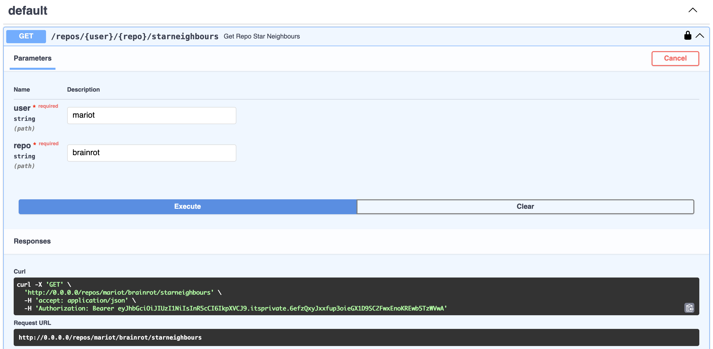

# Stargazer

Web service to get intel about repository star stats.

## How It Works

- Fetches the count of starred repositories for each stargazer of a given repository.
- Categorizes stargazers based on their starred repositories count.
- If the stargazer has starred more than 100 repositories, fetch the starred repositories by batches of 100.
- If the stargazer has starred less than 100 repositories, batch the stargazer's ID with other stargazers with less than 100 repositories; then fetch them at once.

## Requirements

- Docker

## Setup

1. Clone the repository:

    ```sh
    git clone https://github.com/mariot/stargazer.git
    cd stargazer
    ```

2. Create a `.env` file with the following environment variables:

    ```sh
    GITHUB_API_SECRET
    SECRET_KEY
    ```

3. Build the Docker image:

    ```sh
    docker build -t stargazer .
    ```

4. Run the Docker container:

    ```sh
    docker run --name mycontainer --env-file .env -p 80:80 stargazer
    ```

5. The web service should now be running and accessible at `http://0.0.0.0:80`.

## Usage

You can interact with the web service using any HTTP client (e.g., `curl`, Postman).

Go to `http://0.0.0.0:80/docs` to see the API documentation.


Use the `/users/` endpoint to create a new user:


Use the authorize button to log in and get the token:


Use the `/repos/{owner}/{repo}/starneighbours` endpoint to get the stargazers of a repository:



## Improvements

- Add pagination to the `/repos/{owner}/{repo}/starneighbours` endpoint.
- Add logging.
- Improve error handling.
- Use map-reduce instead of for loops.
- Add security to account creation; add superuser role.
- Find way to process more than 40000 stars.
- Add randomized data for testing.
- Add CI/CD pipeline.
